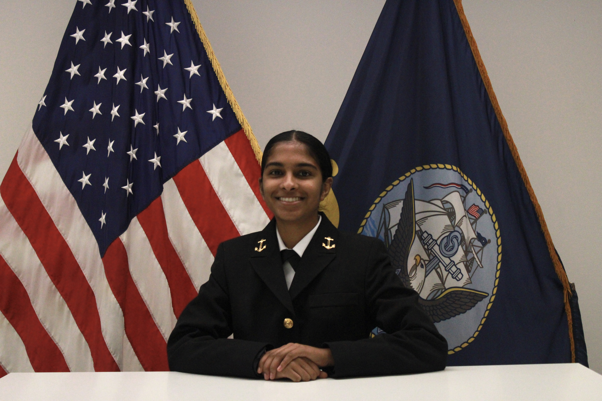

## Introduction

 
I am a 3rd year Mechanical Engineering student at Cornell University and a Midshipman in Naval ROTC with an interest in applying engineering principles in real-world defense, aviation, and maritime systems. I am developing strong foundations in dynamics, thermofluids, materials, and control systems, and I enjoy translating theory into hands-on projects and technical analysis. Through my academic work and military training, I’ve learned to approach engineering challenges with discipline, problem-solving, and leadership — skills I continuously refine through coursework, labs, and ROTC responsibilities.

I am hopign to pursue a career as a U.S. Navy Submarine Officer and plan to attend Nuclear Power School after graduation. I am motivated by the complexity and high-accountability environment of naval nuclear propulsion systems and the opportunity to contribute to mission-critical operations under demanding conditions. My long-term interests include submarine engineering, nuclear propulsion technology, and advanced defense systems. This portfolio showcases selected technical work, projects, and experiences as I continue developing as an engineer, leader, and future naval nuclear officer.

Below is my resume: 
[Download My Resume]({{ "/NavyaPenatiResume.pdf" | relative_url }})

Take a look at <a href="{{ "/projects/" | relative_url }}">my projects</a> and <a href="{{ "/cv/" | relative_url }}">CV</a>.
